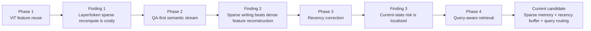

# 当前研究路线总览：从 ViT 帧间复用到 Query-aware Semantic Stream

日期：2026-06-03

本文用于把目前所有尝试串成一条顶会论文视角下的设计逻辑路线。重点不是展示“做过很多工程版本”，而是说明每次尝试如何产生一个研究发现，并逐步收敛到当前更优雅的最终方法候选。

配套 draw.io 图：

```text
docs/figures/streaming_vlm_design_route_20260603.drawio
```

## 1. 总体问题重定义

最初问题是：

```text
如何在流式视频中复用相邻帧 ViT 计算？
```

经过一系列实验后，问题被修正为：

```text
如何把密集视觉流转化为 QA 可用的稀疏语义流，
同时减少视觉计算、视觉 token 写入和后端 KV/cache 干扰？
```

这一步非常关键。最终论文不应写成“我们尝试了很多 ViT sparse tricks”，而应写成：

> Streaming video VLMs do not need dense frame-level visual reconstruction. They need a compact, query-aware visual semantic state.

当前候选方法可以概括为：

```text
Query-aware Sparse Semantic Stream Routing
```

由三部分组成：

1. `Sparse Semantic Memory`：长期语义变化帧。
2. `Current-state Buffer`：问题到来前的短期最近状态。
3. `Query-aware Temporal Routing`：问题阶段选择使用长期记忆还是当前状态。

## 2. 路线分层图



## 3. 每一阶段如何被利用

### 3.1 Turbo-ViT v1：逐层 token 复用

原始想法：

```text
reference frame full encode
non-reference frame per-layer token similarity
dynamic token recompute
static token reuse
```

实验发现：

- 机制可以保持较高 feature fidelity。
- 但逐层、逐 token 判断带来显著 selector / top-k / gather / scatter 开销。
- 在 GPU 上，朴素 sparse recompute 很难稳定超过 dense。

被利用的价值：

```text
证明跨帧冗余存在；
同时证明最终方法不能依赖昂贵的逐层 token 判别。
```

论文中的转化方式：

> Fine-grained token reuse exposes redundancy, but per-layer dynamic selection itself becomes the bottleneck.

### 3.2 v2-v8：routing、dual-anchor、segment、K/V reuse

核心尝试：

- v2：先做低成本帧级 routing，再决定 skip / sparse / dense。
- v3：feature-aware staged routing，减少 false skip。
- v4/v5：semantic stability，rolling anchor + long anchor。
- v6/v7：token group / segment-aware reuse。
- v8：layer-aware static K/V reuse。

实验发现：

- patch MSE 不能可靠预测最终视觉误差。
- 中层/深层 feature 更能解释 drift，但在线计算成本高。
- dual-anchor 有价值，rolling anchor 处理短期变化，long anchor 抑制长期漂移。
- segment/group 选择能提升质量，但当前 PyTorch sparse path 不够 GPU-friendly。
- 非融合 sparse tensor 操作触碰工程边界。

被利用的价值：

```text
这些版本不应作为最终方法堆叠展示；
它们共同支持“语义稳定性”作为统一信号，
并支持“不要继续主攻非融合 token sparse recompute”。
```

论文中的转化方式：

> The key signal is not patch-level change, but semantic stability across short-term and long-term anchors.

### 3.3 Speed-first 与 STC 对比后的目标修正

重要转折：

早期我们过度关注：

```text
feature cosine / MSE
```

但 STC/streaming VLM 类任务最终看的是：

```text
QA performance under latency/cache constraints
```

实验发现：

- 一些 feature cosine 不高的速度优先方案，在 QA 上未必失败。
- 严格逐帧还原 dense feature 会过早否定有价值的压缩策略。
- 只优化 ViT 内部计算无法覆盖后端上下文写入和 cache 增长问题。

被利用的价值：

```text
评价目标从 feature reconstruction 转为 QA-constrained semantic compression。
```

论文中的转化方式：

> We treat feature fidelity as a diagnostic signal, not as the optimization target.

### 3.4 Semantic Stream Gate：从 ViT 加速到视觉语义写入压缩

方法：

```text
每帧先计算轻量 semantic signature；
根据 reference / refresh / drift_keep / skip 决定是否完整视觉编码和写入视觉 token。
```

关键结果：

RVS-Movie repeat3：

| method | speedup | token reduction | kept frames |
|---|---:|---:|---:|
| r16/t0.1 | 5.86x | 85.3% | 119 / 811 |
| r64/t0.3 | 8.59x | 93.1% | 56 / 811 |

RVS-Ego repeat3：

| method | speedup | token reduction | kept frames |
|---|---:|---:|---:|
| r16/t0.1 | 2.91x | 84.5% | 318 / 2046 |
| r64/t0.3 | 3.67x | 93.8% | 127 / 2046 |

被利用的价值：

```text
这是第一次在真实流式 VQA 小子集上证明：
语义流稀疏化可以同时减少视觉计算和视觉 token/cache 写入。
```

论文中的转化方式：

> Sparse semantic writing is more effective than approximating dense ViT outputs frame by frame.

### 3.5 RVS-Ego failure analysis：发现 current-state 风险

关键失败：

```text
Question: What setting is portrayed in the latest clip?
GT: A kitchen setting.
Sparse r64: The latest clip shows a kitchen setting with a Christmas tree in the background.
```

实验发现：

- r16 没有 correctness loss。
- r64 的唯一 correctness loss 出现在 `scene_latest`。
- 风险不是全局 action 理解崩坏，而是 latest/current-state 细节被旧视觉上下文干扰。

被利用的价值：

```text
自然引出短期 current-state buffer，而不是全面回退 dense。
```

论文中的转化方式：

> Aggressive semantic sparsification mainly risks stale current-state details, suggesting targeted correction rather than dense fallback.

### 3.6 Recency Correction：短期状态补偿

方法：

```text
问题到来前，强制写入最近 K 帧。
```

结果：

| K | kept frames | token reduction | speedup | token W/T/L |
|---:|---:|---:|---:|---:|
| 0 | 127 / 2046 | 93.79% | 3.50x | 4 / 19 / 1 |
| 2 | 141 / 2046 | 93.11% | 3.59x | 5 / 19 / 0 |
| 4 | 157 / 2046 | 92.33% | 3.49x | 9 / 15 / 0 |
| 8 | 186 / 2046 | 90.91% | 3.42x | 6 / 17 / 1 |

实验发现：

- K=4 是较好折中。
- 继续增大 K 不单调提升质量。
- 但 K=4 仍未完全修复 `Christmas tree` stale 信息。

被利用的价值：

```text
证明 current-state buffer 必要；
同时证明仅增加最近帧不够，还必须控制问题阶段使用哪些视觉 KV。
```

论文中的转化方式：

> Current-state correction should be a compact buffer, not a larger dense suffix.

### 3.7 Query-aware Recent Retrieval：问题阶段视觉状态路由

方法：

```text
latest/current/setting 类问题：
    只检索最近 N 个视觉块；
其他问题：
    使用 ReKV 内部 retrieval。
```

关键结果：

| method | latest blocks | token reduction | speedup | mean token-F1 | W/T/L |
|---|---:|---:|---:|---:|---:|
| Recency only | all/internal | 92.33% | 3.49x | 0.2937 | 9 / 15 / 0 |
| Query routing | 4 | 92.33% | 3.59x | 0.3076 | 10 / 14 / 0 |
| Query routing | 8 | 92.33% | 3.56x | 0.3001 | 8 / 16 / 0 |
| Query routing | 16 | 92.33% | 3.80x | 0.2937 | 9 / 15 / 0 |

关键样例：

| method | prediction |
|---|---|
| Recency K=4 | kitchen setting with a Christmas tree |
| qrb=4 | kitchen |
| qrb=8 | kitchen |
| qrb=16 | kitchen setting with a Christmas tree |

Qwen2.5-VL judge，qrb=4：

```text
sparse correct: 66.7%
dense correct: 61.9%
scene_latest sparse: 83.3%
scene_latest dense: 66.7%
dense-only correct: 0
```

qrb=4 repeat3：

```text
speedup: 3.72x - 3.79x
token/cache write reduction: 92.33%
mean token-F1: 0.3076
W/T/L vs dense: 10 / 14 / 0
```

被利用的价值：

```text
第一次证明后端视觉状态路由能修复前端稀疏写入留下的 stale context 问题。
```

论文中的转化方式：

> The right temporal state should be selected at query time. More context is not always better; cleaner current-state context can be better.

## 4. 当前方法应该如何命名和表述

推荐主方法名：

```text
Query-aware Sparse Semantic Stream Routing
```

或更短：

```text
Q-Stream
```

方法结构：

```text
Dense video stream
    -> Semantic stream gate
        -> Sparse semantic memory
        -> Current-state buffer
    -> Query-aware temporal routing
        -> latest/current: recent buffer
        -> long-horizon/action/object: semantic memory / internal retrieval
    -> VLM answer
```

论文表述重点：

1. **不是 ViT 特征复原方法**：feature cosine/MSE 只用于诊断。
2. **不是简单帧采样**：保留由 semantic stability 和 query intent 决定。
3. **不是单独 cache pruning**：前端计算、视觉写入、后端 retrieval 被统一控制。
4. **不是工程堆叠**：每个模块都来自一个明确 failure mode。

## 5. 顶会发表视角下的主张

可以形成三条主张：

### Claim 1：Streaming VLM 的冗余应在语义流层面处理

证据：

- RVS-Movie r64/t0.3：8.59x speedup，93.1% token reduction。
- RVS-Ego r64/t0.3：3.67x speedup，93.8% token reduction。

### Claim 2：QA-first 约束比 feature reconstruction 更合理

证据：

- r64/t0.3 feature 偏离 dense，但 QA proxy / judge 未明显崩坏。
- 稀疏上下文有时比 dense 更集中，出现 sparse-only correct。

### Claim 3：query-aware routing 是解决 stale visual context 的关键

证据：

- Recency only K=4 不能修复 `Christmas tree`。
- qrb=4 修复该 case，并提升 scene_latest judge accuracy 到 83.3%。

## 6. 下一步研究计划建议

### 6.1 近期优先级

1. 在 RVS-Movie 上复现 `recency K=4 + qrb=4`。
2. 将 latest/current 关键词路由升级为轻量 query classifier。
3. 加入 long-horizon / action / object 的不同 routing policy。
4. 记录 QA 阶段检索块数、QA prefill latency、KV/cache footprint。

### 6.2 中期实验矩阵

| 维度 | 当前已有 | 下一步 |
|---|---|---|
| 数据 | RVS-Ego, RVS-Movie 小子集 | 更大 RVS subset, OVO/StreamingBench |
| 模型 | LLaVA-OV-7B | 0.5B/7B/更大模型横向 |
| 评价 | token-F1, rule, Qwen judge | 官方指标 + LLM judge + latency/cache |
| 方法 | semantic gate + recency + latest routing | query classifier + multi-policy routing |

### 6.3 最终论文方法应避免的表达

不要写：

```text
我们先做 v1，然后 v2，然后 v3...
```

应该写：

```text
Observation 1: dense feature reconstruction is unnecessary.
Observation 2: sparse semantic writing gives large compute/cache gains.
Observation 3: stale current-state errors require query-aware routing.
Method: Query-aware Sparse Semantic Stream Routing.
```

这样中间尝试都被吸收成 insight，而不是暴露为工程堆叠。

## 7. 当前结论

当前研究已经从“ViT 稀疏更新”推进到“流式视频 VLM 的语义状态管理”。

最值得继续推进的主线是：

```text
Sparse Semantic Memory
    + Current-state Buffer
    + Query-aware Temporal Routing
```

这条路线同时覆盖：

- 前端视觉计算加速；
- 视觉 token/cache 写入压缩；
- 后端 retrieval/context 干扰控制；
- QA-first 任务精度约束。

它比单纯复刻 STC 或单纯优化 ViT 更适合作为顶会论文方法主线。
